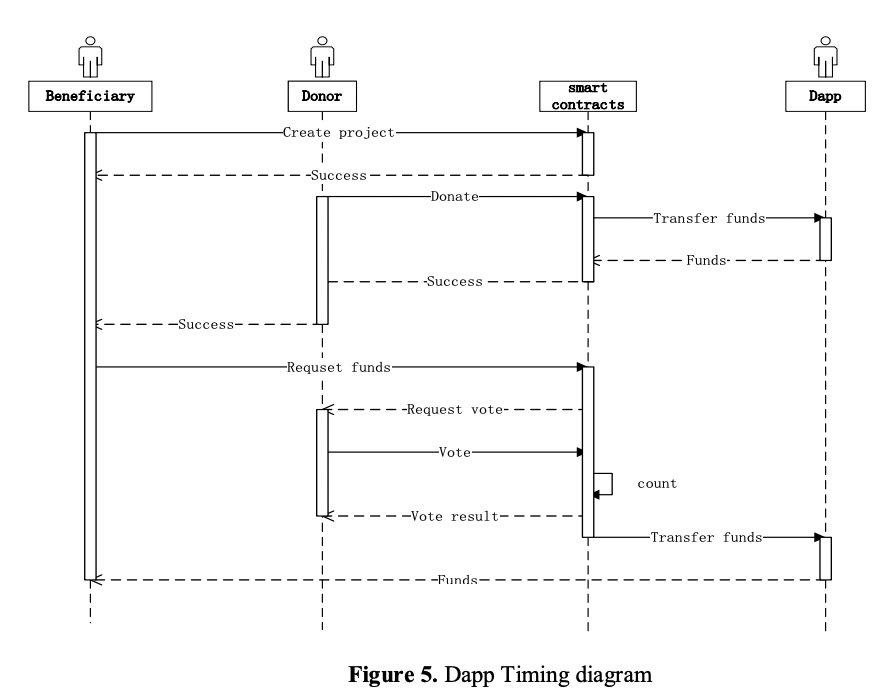
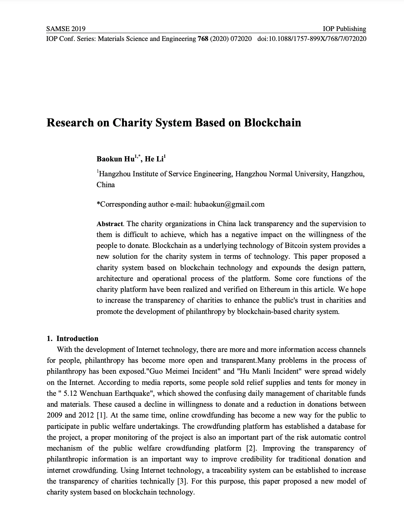
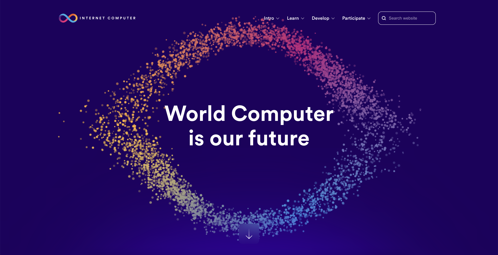
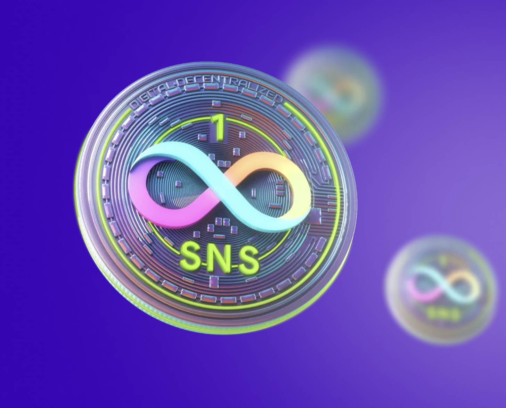

# **`The Giving tree`**
> A transparent charity system based on blockchain.

---
## 1. Why?

1. 기부 단체를 신뢰하기 어렵다. (자금 관리의 투명성)
2. 제도의 사각지대가 존재. (중앙화된 운영의 어려움)
3. 블록체인을 활용하면 현재 보다 더 투명하면서도 민첩한 기부 서비스를 만들 수 있다.
    1. 오픈소스 / 스마트 컨트랙트를 활용한 자금의 투명성 제공
    2. Dao를 통해 민첩한 탈중앙 시스템 제공

---
## 2. 기대 효과

1. 비영리단체의 자금 관리 투명성
    1. `블록체인`을 통해, 투명하게 후원금의 출처를 확인 가능합니다.
    2. `스마트 컨트랙트`를 통해 `후원금` 관리가 탈중앙화 되어 동작합니다.
2. 기부금 수혜자의 자금 사용 투명성
    - `Dao`를 통해 `후원자`들은 `수혜자`들을 투표하여 `자금 사용 투명성`을 검증할 수 있습니다.
3. 효율적 자금 사용계획 유도
    1. `Dao`를 통해 `수혜자`는 투표를 받게 됩니다.
    2. 이는 더 효율적이고 유의미한 기부 프로그램을 고민하고 생성하도록 유도합니다.
4. 자발적인 생태계 참여
    1. `Dao`와 같은 `비전`을 가진, `후원자`들은 자발적으로 생태계에 기여하며 Dao를 이끌게 됩니다.
    2. 즉 기부가 필요한 영역에 자발적인 관심과 유의미한 기여를 할 수 있습니다.

---
## 3. 용어 정리

1. `Beneficiary`/ 수혜자: 지원금이 필요한 수혜자 (개인 / 단체)
2. `Donor`/ 후원자: 기부금 후원자 (개인 / 단체)
3. `Proposal`/ 제안서: `수혜자`가 모금을 어떻게 사용할지에 대한 로드맵 계획서.
4. `Smart Contracts`: 펀드 자금을 관리하는 탈중앙화 프로그램.
5. `Dapp`: 사용자들이 투명하게 기부금 모금/사용하도록 돕는 웹 플랫폼.

---
## 3-1. `Beneficiary` (수혜자)

- `수혜자`는 `Proposal`을 작성하여 후원 프로그램을 생성할 수 있습니다.
- `수혜자`는 기부금이 필요한 개인 또는 기부금이 필요한 단체/기관이 될 수 있습니다.
- 후원 요청을 위해서는 `Dapp`에 `Proposal`양식에 맞게 후원금 사용 로드맵을 작성해야 합니다.
- `Proposal`을 통해 `수혜자`는 `후원자`들을 모집합니다.
- 펀드 성공 이후, `수혜자`는 지원금을 로드맵에 따라 n회에 걸쳐 지급받습니다.

---
## 3-2. `Donor` (후원자)

- `후원자`는 `기부 프로그램`을 선택하고 기부금을 지급합니다.
- `후원자`는 `수혜자`의 로드맵을 n회 투표를 통해 진행 사항을 평가합니다.
- 로드맵을 불이행한 `수혜자`는 `후원자`의 투표 결과에 따라 펀드가 중간 무산될 수 있습니다.

---
## 3-3. `Proposal` (제안서)

- `제안서`를 통해 `수혜자`는 `후원자`들을 모집할 수 있는 `후원 프로그램`을 만들 수 있습니다.
- 프로그램은 `단기` / `장기` 프로그램으로 구분되며, 각 양식에 따라 수혜자는 `로드맵`을 작성합니다.
- 장기 프로그램의 경우, 수혜자는 n회에 걸쳐 `후원자`들의 투표를 통해 평가를 받습니다.
- 장기 프로그램의 경우, 모금된 펀딩 금액을 n회에 걸쳐 수령합니다.

---
## 3-4. `Smart Contracts`

- 후원금 모금과 지급이 투명하게 관리되도록 하는 `탈중앙화 블록체인 기반 프로그램`
- 펀딩 성공/실패를 **투표 결과에 따라 관리하는 프로그램**
- 펀딩 성공 시, 수혜자에게 n회에 걸쳐 지원금이 지급되도록 관리
- 펀딩 실패 시, 후원자들에게 기부금을 반환
- 펀딩 결과에 따라 Dapp 운영/개발을 위한 플랫폼 수수료를 일정 부분 관리

---
## 3-5. `Dapp` (platform)

- 블록체인 기반의 탈중앙화된 어플리케이션으로 총 4가지 시스템이 존재합니다.
    1. `후원-프로그램 관리 시스템`
    2. `모금 관리 시스템`
    3. `사용자 인증 시스템`
    4. (opt) `Donor`(후원자) 팔로우 시스템

---
## 4. Dapp
> 개발해야할 3가지 시스템

1. `후원-프로그램 관리` 시스템
    1. 후원 프로그램 생성/수정 할 수 있는 웹서비스 기반 Dapp
    2. 후원 프로그램을 투표할 수 있는 탈중앙화된 DAO
2. `모금 관리` 시스템
    1. 기부 프로그램 생성하는 스마트 컨트랙트
    2. 후원금을 전달할 수 있는 스마트 컨트랙트
    3. 수혜자에게 펀딩 금액을 지급하는 스마트 컨트랙트
    4. 비영리 단체 운영을 위한 수수료 지급 스마트 컨트랙트
3. `사용자 인증/평가` 시스템
    1. 수혜자 평가 시스템 (i.g. 당근마켓 온도)
    2. 수혜자 / 기부자 지갑 연결

---
## 

---
## 5. 핵심 로직 (1)

- **수혜자 기부-프로젝트 생성과 기부자들의 후원 과정**
    1. `수혜자`는 `Dapp`에 접속하여, `Proposal` 양식에 맞춰 기부 프로젝트를 생성한다.
    2. 프로젝트 생성시 자금이 운용될 수 있는 스마트 컨트랙트가 내부적으로 생성된다.
    3. 이후 `기부자`들은 생성된 프로젝트를 선택하여 `스마트 컨트랙트`를 통해 `Dapp`으로 후원금을 전송한다.
    4. 펀딩 완료시, `Dapp`은 `스마트 컨트랙트`에 따라 수혜자에게 1회차 지원금을 지급한다.

---
## 5. 핵심 로직 (2)

- **수혜자의 n회차 지원금 요청**
    1. 최초 이후, 수혜자는 자신의 Proposal 로드맵에 맞게 활동하고 있음을 증명하여, n회차 펀딩 금액을 요청한다.
    2. 후원자들은 활동내역의 성실함을 투표한다.
    3. 투표 결과에 따라 일정 금액의 후원금액이 추후 지급된다.

---
## 6. 시스템 레퍼런스

- `Baokun Hu`의 논문 "Research on Charity System Based on Blockchain"을 참조하여 시스템 디자인
- [논문 Link](https://iopscience.iop.org/article/10.1088/1757-899X/768/7/072020/pdf)
 

---
## 7. 개발 계획

- 스위스 비영리 단체 Dfinity의 `Internet computer protocol`
- 현재 유일하게 100% on-chain으로 운영중
- 암호화폐 오픈소스 지속적으로 1위 생태계
- 뛰어난 디자이너 / 개발자들 유입 용이

---
## 7. 개발 계획

- `SNS-1 token`를 활용한 Dao 투표 서비스 개발
- `ICP`를 활용한 탈중앙화 Dapp과 스마트 컨트랙트 개발
- Front
    - [`Svelte`](https://svelte.dev/)
    - [`Typescript`](https://www.typescriptlang.org/)
    - [`Tailwind css`](https://tailwindcss.com/)
- Server
    - [`dfinity/ic`](https://github.com/dfinity/ic)
    - [`Rust`](https://www.rust-lang.org/)
