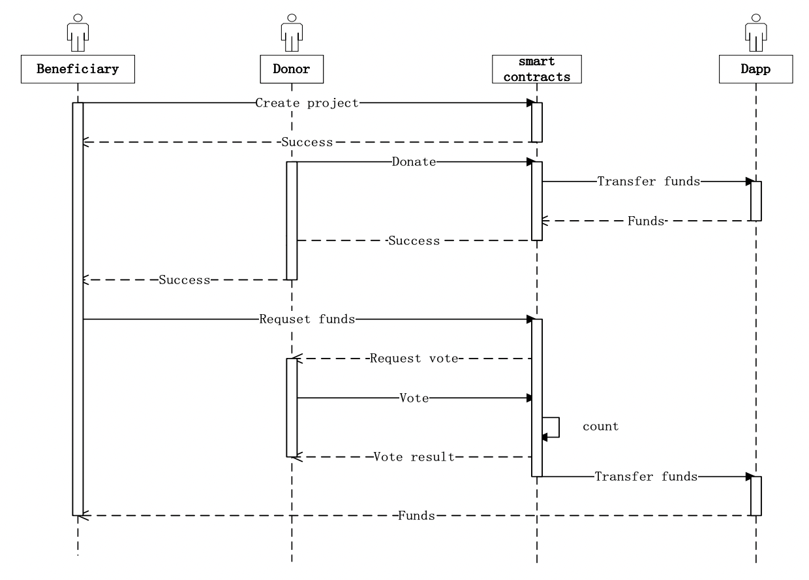

# (WIP) version 0

## refs: donation system design

- [Research on Charity System Based on Blockchain](https://iopscience.iop.org/article/10.1088/1757-899X/768/7/072020/pdf)

- [SatSale: bitcoin based donation payment](https://github.com/SatSale/SatSale)

## refs: donation sites

- [GiveDirectly](https://www.givedirectly.org/)
- [PSCORE](https://pscore.org/)
- [Liberty In North Korea](https://www.libertyinnorthkorea.org/donate)
- [Cherry: Blockchain based charity](https://givecherry.org/)

