# **`i-bridge`**

A `bridge` connecting North Korean defectors with the world.

https://github.com/istorykorea/i-bridge

---
# `GiveDirectly`

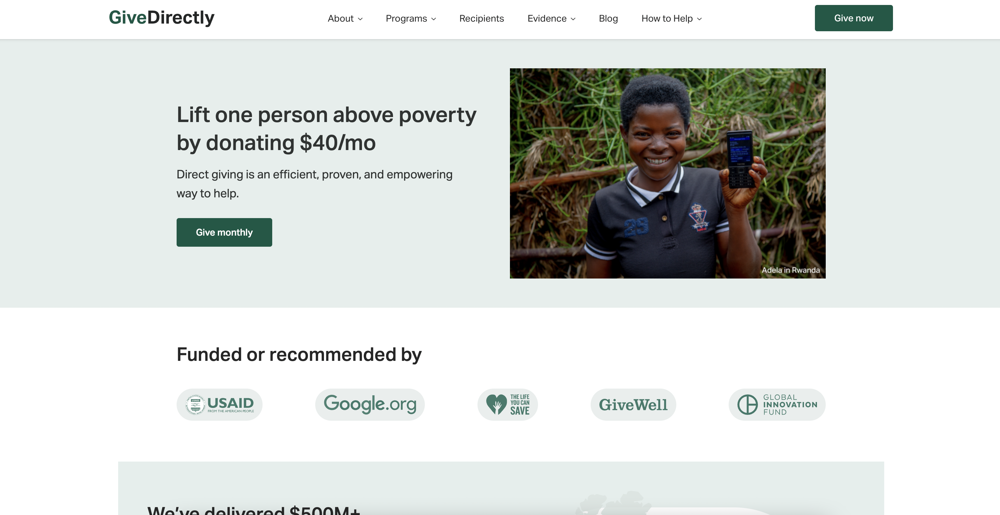

---

# 1. GiveDirectly
> 동아프리카에서 운영되는 비영리 단체로 **휴대전화를 통해 조건 없는 현금 송금**을 통해 극빈층 가정을 돕습니다. GiveDirectly는 주로 케냐, 우간다, 르완다 사람들에게 자금을 이체합니다.

- `Web`
    - `Home`: 요약 소개
    - `About`: 소개
    - `Programs`: 기부 프로그램들
    - `Recipients`: 실시간 수혜자 후기
    - `Evidence`: 현금 사용 증거들
    - `How to Help`: 도울 방법들

---

# 1-1. GiveDirectly
> Home

---

# 1-1. GiveDirectly
> Home

- 개발 난이도: 하 (`approx ~8h`)
- 단순하게 Give Directly는 소개
- ui 꾸미는 것에 익숙하지 않아서, 시간이 조금 걸립니다.
- static 페이지

---

# 1-2. GiveDirectly
> About

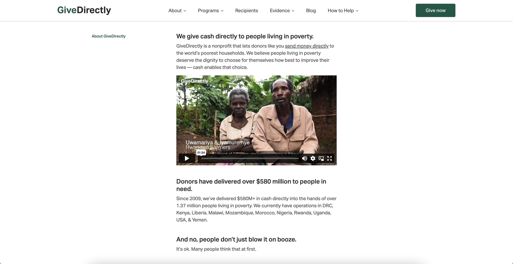

---

# 1-2. GiveDirectly
> About

- What we do: 하는 일
- Values: 철학적 가치관과 방향성
- Financials: 돈 관리 (출처, 사용처)
- Funders & Partners: 후원자 / 파트너
- Team: 팀원 소개
- Career: 팀원 모집
- FAQ: 질의 응답
---
# 1-2. GiveDirectly
> About

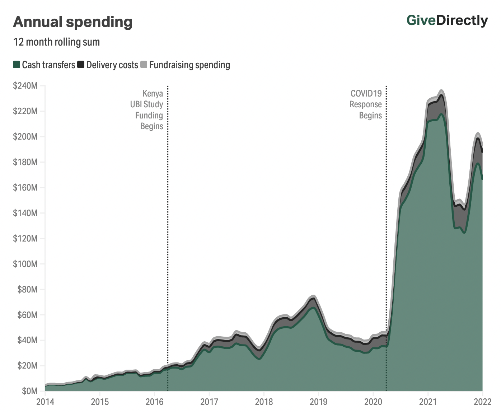

- 개발 난이도: 하 (`approx ~20h`)
- 단순한 static 페이지
- 단, 페이지 내용이 많다.
- graph 개발의 경우 추가 공부 필요.

---
# 1-3. GiveDirectly
> Programs: 기부할 프로그램들

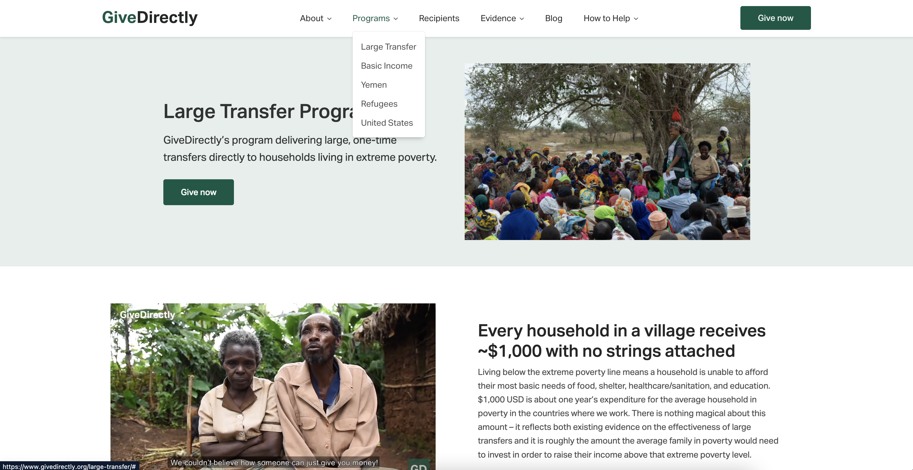

---

# 1-3. GiveDirectly
> Programs

- Large Transfer
- Basic Income
- Yemen
- Refugees
- United States

---

# 1-3. GiveDirectly
> Programs

- 개발 난이도: 하 (`approx ~20h`)
- Program을 생성하는 부분, Give now 부분은 하단에 별도로 산정

---

# 1-4. GiveDirectly
> Recipients

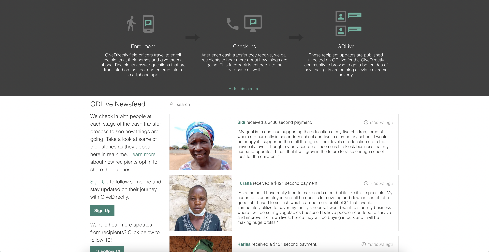

---

# 1-4. GiveDirectly
> Recipients

- 내부적으로 `GiveDirectly`와 별개의 새로운 서비스로 이동
- https://live.givedirectly.org
- 웹 서버가 필수적으로 필요
- 돈을 지급해주고, 상담원들이 전화를 통해 피드백을 듣고 글을 작성

---

# 1-4. GiveDirectly
> Recipients

- `후원자`
    - 로그인 / 회원가입
    - 내가 팔로우한 인물 목록 보기 
    - 인물 팔로우 기능 (10명)
- `상담원`
    - 인물 사진 / 인물 글 등록 페이지 필요
    - 웹사이트 어드민 필요
- `홈페이지`
    - 페이지네이션 된 인물들 나열
    - 인물 검색 기능

---

# 1-4. GiveDirectly
> Recipients

- 개발 난이도: 중
    - `프론트` (`approx 20h <=`) 
    - `백엔드`/서버 (`approx 60h <= `)
- 서버 배포는 별개로 시간 필요합니다.

---

# 1-5. GiveDirectly
> Evidence

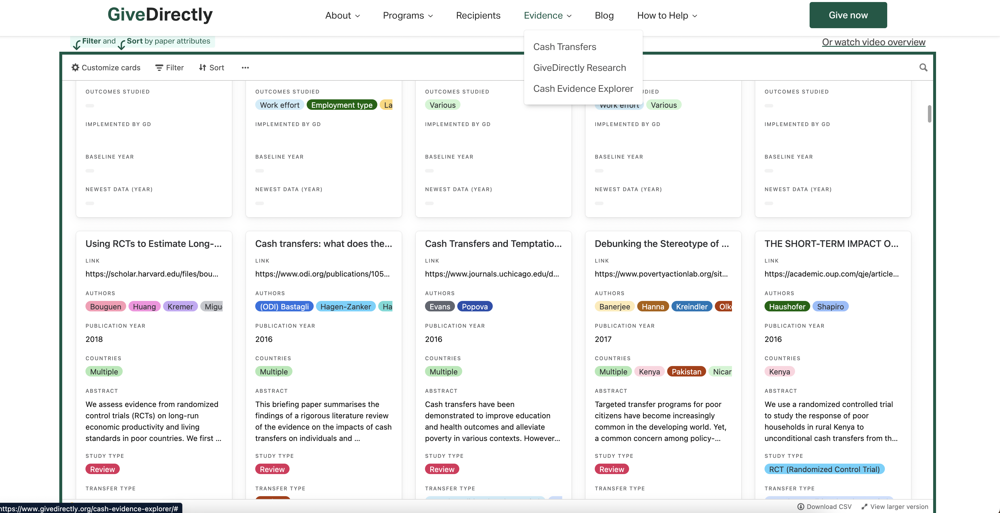

---

# 1-5. GiveDirectly
> Evidence

- Cash Transfers
- GiveDirectly Research
- Cash Evidence Explorer

---

# 1-5. GiveDirectly
> Evidence

- 개발 난이도: 하
- 대신 Airtable이라는 서비스를 돈주고 사용해야 합니다.

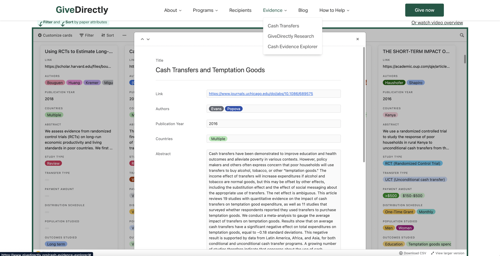

---

# 1-6. GiveDirectly
> How to Help?

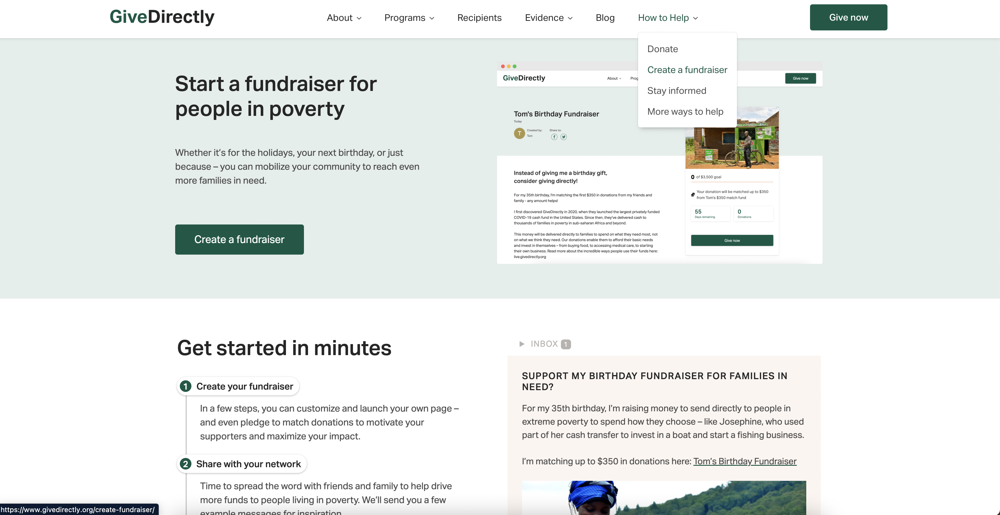

--- 

# 1-6. GiveDirectly
> How to Help?

- `Donate`: 후원금 지불
- `Create a fundraiser`: 펀드모금 생성
- `Stay informed`: 이메일 신청
- `More ways to help`: 가이드

---

# 1-6. GiveDirectly
> Donate

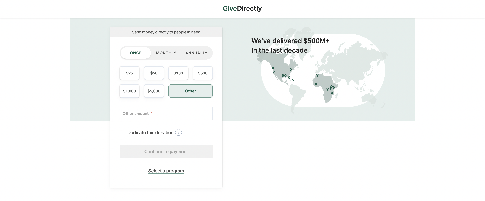

- 지불 방식
    - Once
    - Monthly
    - Annually
- 금액
- 프로그램 선택

---

# 1-6. GiveDirectly
> Donate

아프리카, 미국등 여러가지 기등록된 프로그램들 중 하나를 선택할 수 있습니다.

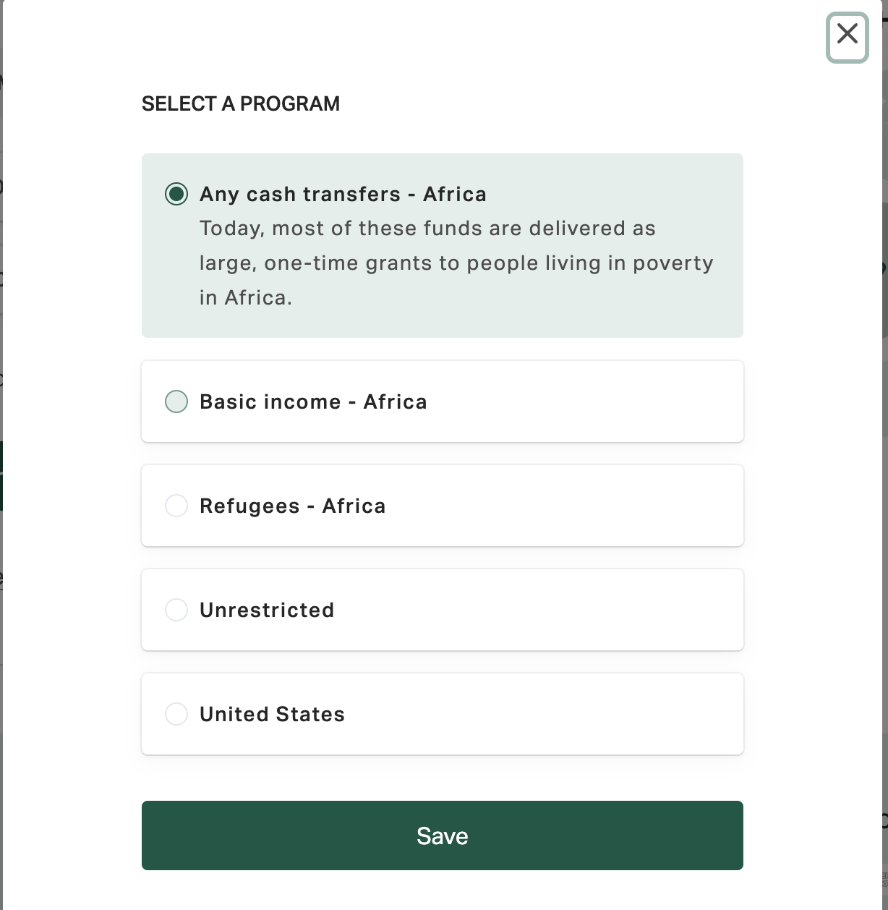

--- 

# 1-6. GiveDirectly
> Donate

- 카드
- Paypal
- 수표 / 주식
- 암호화폐 (BTC, ETH)

등을 활용해 후원신청이 가능합니다.

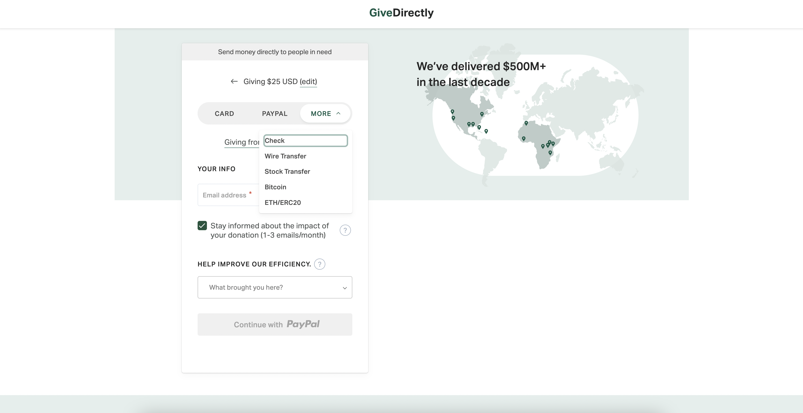

---

# 1-6. GiveDirectly
> Donate

- 개발 난이도: 상 (`200h <=`)
- 카드 / 페이팔 / 암호화폐 결제를 위해 필요한 `결제 시스템` 구축
- 월/년 주기적 결제를 위해서는 `예약 시스템` 개발 필요
- 돈 관련된 사항은 `세금 보고` 문제로 보기보다 내부적으로 개발해야할 것들이 보이는 것 보다 더욱 많아 보입니다.
- 만약 `체리`와 같이 후원자들 `절세` 혜택을 주기위해서는 추가적인 개발 필요.

---

# 1-7. GiveDirectly
> Fund raisers

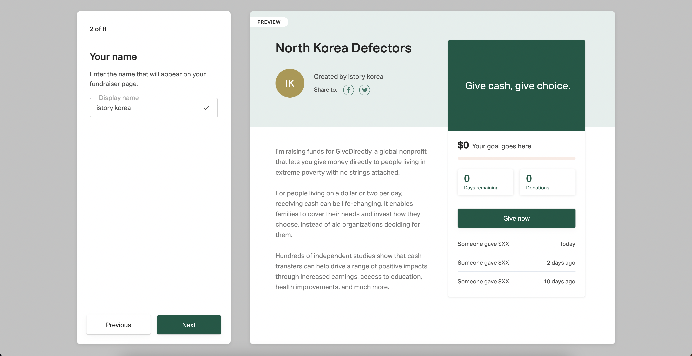

---

# 1-7. GiveDirectly
> Fund raisers

1. 총 7단계로 진행
2. 최종적으로 우측과 같은 펀드 프로그램을 등록합니다.

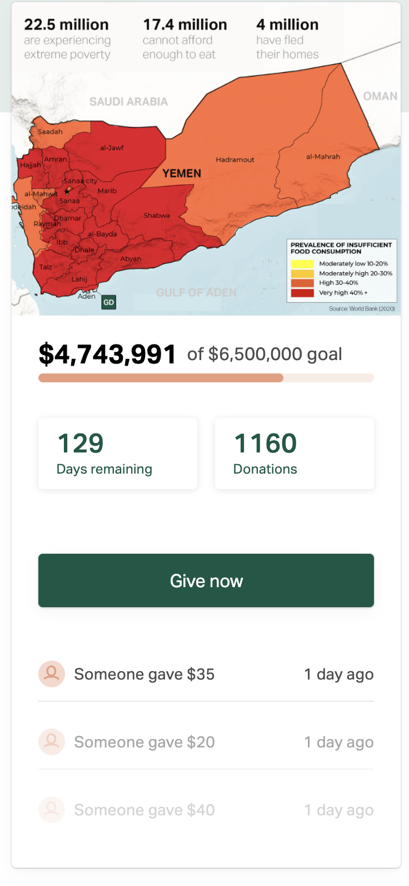

---

# 1-7. GiveDirectly
> Fund raisers 

아래 내용들을 설정합니다.

1. 펀딩 이름
2. 펀딩 설명
3. 펀딩 기간
4. 펀딩 목표 금액
5. 펀딩 이미지
6. 펀딩 공개 여부 등

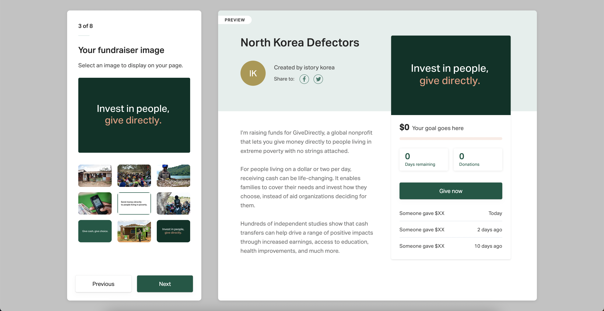

---

# 1-7. GiveDirectly
> Fund raisers 

- 개발 난이도: 상 (`200h <=`)
- 펀드 등록하는 폼 UI 개발
- 등록된 펀드들을 관리할 수 있는 어드민 페이지 필요 (관리자용)
- **펀드 생성 시, 펀드에 들어가는 돈을 넣을 수 있는 은행 계좌 / 암호화폐 지갑**등을 만드는 서버 개발 필요
- 펀드가 보여질 UI 개발 필요

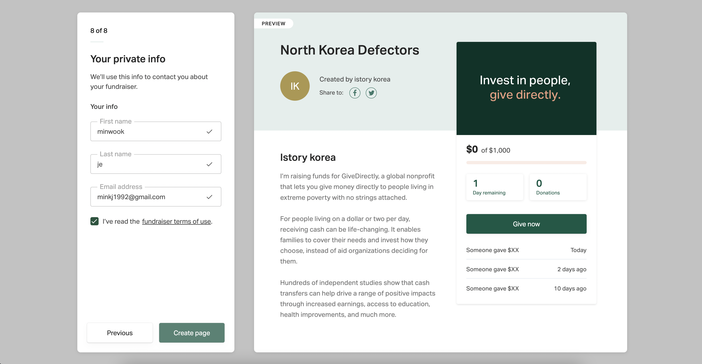

---

# Conclusion: 개발

- **개발 측면**
    - 최대한 낙관적으로 시간 산정을 했지만, 4개월 기간동안 완성시킬 수 있을지 현실적으로 불가능.
    - GiveDirectly는 [1000 여명의 사원수](https://www.linkedin.com/company/givedirectly/about/), 그 중 최소 1% 개발자라고 해도 약 10명의 개발자가 서비스 개발 중.
    - 만약 개발을 한다면, 위에 나열된 많은 기능 들 중 **우선순위를 확실하게 정해야 할 것.**

---
# Conclusion: 기획

- **기획 측면**
    - 차라리 **`GiveDirectly`에 Fund raiser로 north korea defectors 관련 펀드를 등록하는 방법**은?
    - 이미 존재하는 (북한 관련) 기부 서비스들을 사용하지 않고, 새롭게 만든다면 차별점이 있어야 할 것.
        - https://pscore.org/home/
        - https://www.libertyinnorthkorea.org/donate
        - https://givecherry.org/

---
# (Proposal) 기획 아이디어

[뉴스: 기부자 57% "사용내역 몰라"…기부 안하는 이유 61% '불신'
](https://www.yna.co.kr/view/AKR20190422151600004)

- 사실 기부는 하고 싶지만, 기부 금액이 정확히 어떻게 사용될지 의심이 들어 못하는 사람들이 많습니다.
- `Cherry`, `GiveDirectly` 등 기존에 국내/해외에 존재하는 기부 서비스들은 시스템 근본적으로 불투명할 수 밖에 없습니다.
- [블록체인을 활용한 기부 시스템](https://iopscience.iop.org/article/10.1088/1757-899X/768/7/072020/pdf)와 이더리움 같은 `Dao` 투표구조를 취한다면, 기부 내역이 투명하게 공개될 수 있는 서비스가 가능합니다.

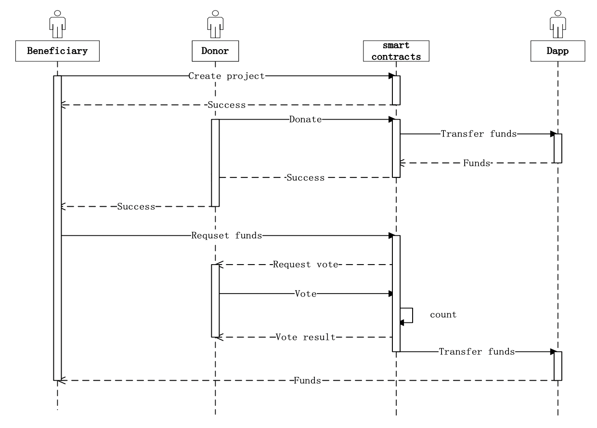
<!-- 

